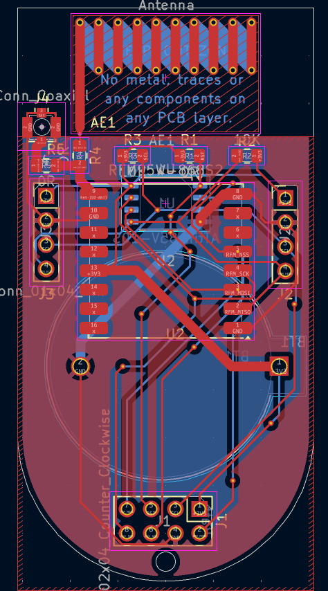

# PPICO V1 Test Board
Simple test board for ppico satellite project. Can be used as sattelite testboard and groud station. The board contains two ports for i2c devices and one port for programming and debugging. The board contains one lorawan transceiver, attiny85 as MCU, coin cell battery for power supply and PCB antenna for easy use, or connector for external antenna.

The board was designed to be usable as a LoRaWAN node.

